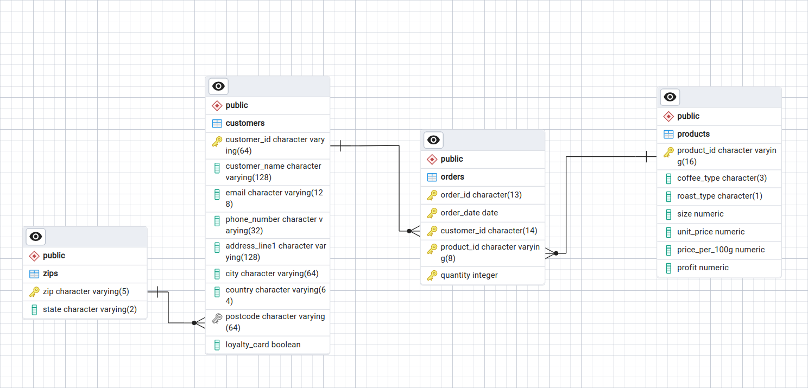

# Coffee Customers dashboard
This is a subdirectory of the coffee customers dashboard.
Unfortunately, there are a lot of things here behind the 
scenes which can't be shown here, I will try to
cover them as good as possible.
### Database architecture
The data is stored in PostreSQL hosted on AWS using RDB
service. The data is split into 4 tables.
- customers
- orders
- products
- zips
  - this is an extra table containing **most** of US zip codes and the state to which they belong.

Together, they look like this:


The difference in data type between zips.zip and customers.postcode
exists due to the latter containing not only US but also Irish and UK zips/postcodes.

### Dashboard tool
As a dashboard software for this project I am using Metabase.
The main reason for going with Metabase instead of Power BI is the lack of Linux support
for Microsoft's products.

Metabase (On-Prem version) is a FOSS product which has to be self-hosted in order to be used.
For this I am using Docker, and I am running the service locally as a container.

To obtain the data displayed in the widgets (visible below) I have connected
Metabase with AWS RDB service and performed following queries:
[CoffeeCustomers_dashboard.png](CoffeeCustomers_dashboard.png)
##### Profit in 2022
```postgresql
SELECT
  SUM("public"."orders"."quantity" * "Products"."profit") AS "Total Profit"
FROM
  "public"."orders"
 
LEFT JOIN "public"."products" AS "Products" ON "public"."orders"."product_id" = "Products"."product_id"
WHERE
  "public"."orders"."order_date" >= timestamp with time zone '2022-01-02 00:00:00.000Z'
```
##### YoY% change in Profit
```postgresql
SELECT
  (
    CAST(
      SUM(
        CASE
          WHEN CAST(
            extract(
              year
              from
                "public"."orders"."order_date"
            ) AS integer
          ) = 2022 THEN "products__via__product_id"."profit"
          ELSE 0.0
        END
      ) AS float
    ) / CASE
      WHEN SUM(
        CASE
          WHEN CAST(
            extract(
              year
              from
                "public"."orders"."order_date"
            ) AS integer
          ) = 2021 THEN "products__via__product_id"."profit"
          ELSE 0.0
        END
      ) = 0 THEN NULL
      ELSE SUM(
        CASE
          WHEN CAST(
            extract(
              year
              from
                "public"."orders"."order_date"
            ) AS integer
          ) = 2021 THEN "products__via__product_id"."profit"
          ELSE 0.0
        END
      )
    END
  ) - 1 AS "YoY% change in Profit"
FROM
  "public"."orders"
 
LEFT JOIN "public"."products" AS "products__via__product_id" ON "public"."orders"."product_id" = "products__via__product_id"."product_id"
```
##### YoY% change in Items Sold
```postgresql
SELECT
  (
    CAST(
      SUM(
        CASE
          WHEN CAST(
            extract(
              year
              from
                "public"."orders"."order_date"
            ) AS integer
          ) = 2022 THEN "public"."orders"."quantity"
          ELSE 0.0
        END
      ) AS float
    ) / CASE
      WHEN SUM(
        CASE
          WHEN CAST(
            extract(
              year
              from
                "public"."orders"."order_date"
            ) AS integer
          ) = 2021 THEN "public"."orders"."quantity"
          ELSE 0.0
        END
      ) = 0 THEN NULL
      ELSE SUM(
        CASE
          WHEN CAST(
            extract(
              year
              from
                "public"."orders"."order_date"
            ) AS integer
          ) = 2021 THEN "public"."orders"."quantity"
          ELSE 0.0
        END
      )
    END
  ) - 1 AS "YoY% change in Items Sold"
FROM
  "public"."orders"
```
##### Loyalty Card Ownership
```postgresql
SELECT
  "public"."customers"."loyalty_card" AS "loyalty_card",
  COUNT(*) AS "count"
FROM
  "public"."customers"
GROUP BY
  "public"."customers"."loyalty_card"
ORDER BY
  "public"."customers"."loyalty_card" ASC
```
##### Order count by Country
```postgresql
SELECT
  "Customers"."country" AS "Customers__country",
  COUNT(*) AS "count"
FROM
  "public"."orders"
 
LEFT JOIN "public"."customers" AS "Customers" ON "public"."orders"."customer_id" = "Customers"."customer_id"
GROUP BY
  "Customers"."country"
ORDER BY
  "count" DESC,
  "Customers"."country" ASC
```
##### Items sold by Country
```postgresql
SELECT
  "Customers"."country" AS "Customers__country",
  SUM("public"."orders"."quantity") AS "Total number of items sold"
FROM
  "public"."orders"
 
LEFT JOIN "public"."customers" AS "Customers" ON "public"."orders"."customer_id" = "Customers"."customer_id"
GROUP BY
  "Customers"."country"
ORDER BY
  "Total number of items sold" DESC,
  "Customers"."country" ASC
```
##### Order count per US state
```postgresql
SELECT
  "Zips"."state" AS "Zips__state",
  COUNT(*) AS "count"
FROM
  "public"."orders"
 
LEFT JOIN "public"."customers" AS "Customers" ON "public"."orders"."customer_id" = "Customers"."customer_id"
  LEFT JOIN "public"."zips" AS "Zips" ON "Customers"."postcode" = "Zips"."zip"
WHERE
  "Customers"."country" = 'United States'
GROUP BY
  "Zips"."state"
ORDER BY
  "Zips"."state" ASC
```
##### Most profitable US States (USD Profit / Order)
```postgresql
SELECT
  "Zips"."state" AS "Zips__state",
  CAST(
    SUM(
      "public"."orders"."quantity" * "products__via__product_id"."profit"
    ) AS float
  ) / CASE
    WHEN COUNT(*) = 0 THEN NULL
    ELSE COUNT(*)
  END AS "profit/orders"
FROM
  "public"."orders"
 
LEFT JOIN "public"."customers" AS "Customers" ON "public"."orders"."customer_id" = "Customers"."customer_id"
  LEFT JOIN "public"."zips" AS "Zips" ON "Customers"."postcode" = "Zips"."zip"
  LEFT JOIN "public"."products" AS "products__via__product_id" ON "public"."orders"."product_id" = "products__via__product_id"."product_id"
WHERE
  "Customers"."country" = 'United States'
GROUP BY
  "Zips"."state"
ORDER BY
  "Zips"."state" ASC
```
##### Most coffee sold by weight (kg)
```postgresql
SELECT
  "source"."Products__coffee_type" AS "Products__coffee_type",
  "source"."Weight coffie sum" AS "Weight coffie sum",
  "source"."Name Changer" AS "Name Changer"
FROM
  (
    SELECT
      "source"."Products__coffee_type" AS "Products__coffee_type",
      "source"."Weight coffie sum" AS "Weight coffie sum",
      CASE
        WHEN "source"."Products__coffee_type" = 'Ara' THEN 'Arabica'
        WHEN "source"."Products__coffee_type" = 'Rob' THEN 'Robusta'
        WHEN "source"."Products__coffee_type" = 'Lib' THEN 'Liberica'
        WHEN "source"."Products__coffee_type" = 'Exc' THEN 'Hybrid'
      END AS "Name Changer"
    FROM
      (
        SELECT
          "Products"."coffee_type" AS "Products__coffee_type",
          SUM("public"."orders"."quantity" * "Products"."size") AS "Weight coffie sum"
        FROM
          "public"."orders"
         
LEFT JOIN "public"."products" AS "Products" ON "public"."orders"."product_id" = "Products"."product_id"
       
GROUP BY
          "Products"."coffee_type"
       
ORDER BY
          "Weight coffie sum" DESC,
          "Products"."coffee_type" ASC
      ) AS "source"
  ) AS "source"
LIMIT
  1048575
```
##### Most profitable coffee types (Total USD Profit)
```postgresql
SELECT
  "source"."products__via__product_id__coffee_type" AS "products__via__product_id__coffee_type",
  "source"."sum" AS "sum",
  "source"."Name changer" AS "Name changer"
FROM
  (
    SELECT
      "source"."products__via__product_id__coffee_type" AS "products__via__product_id__coffee_type",
      "source"."sum" AS "sum",
      CASE
        WHEN "source"."products__via__product_id__coffee_type" = 'Ara' THEN 'Arabica'
        WHEN "source"."products__via__product_id__coffee_type" = 'Rob' THEN 'Robusta'
        WHEN "source"."products__via__product_id__coffee_type" = 'Lib' THEN 'Liberica'
        WHEN "source"."products__via__product_id__coffee_type" = 'Exc' THEN 'Hybrid'
      END AS "Name changer"
    FROM
      (
        SELECT
          "source"."products__via__product_id__coffee_type" AS "products__via__product_id__coffee_type",
          SUM("source"."Profit on sale") AS "sum"
        FROM
          (
            SELECT
              "public"."orders"."product_id" AS "product_id",
              "public"."orders"."quantity" AS "quantity",
              "public"."orders"."quantity" * "Products"."profit" AS "Profit on sale",
              "Products"."coffee_type" AS "Products__coffee_type",
              "Products"."profit" AS "Products__profit",
              "products__via__product_id"."coffee_type" AS "products__via__product_id__coffee_type",
              "Products"."product_id" AS "Products__product_id",
              "products__via__product_id"."product_id" AS "products__via__product_id__product_id"
            FROM
              "public"."orders"
             
LEFT JOIN "public"."products" AS "Products" ON "public"."orders"."product_id" = "Products"."product_id"
              LEFT JOIN "public"."products" AS "products__via__product_id" ON "public"."orders"."product_id" = "products__via__product_id"."product_id"
          ) AS "source"
       
GROUP BY
          "source"."products__via__product_id__coffee_type"
       
ORDER BY
          "sum" DESC,
          "source"."products__via__product_id__coffee_type" ASC
      ) AS "source"
  ) AS "source"
LIMIT
  1048575
```

These queries seem a lot busier than they are supposed to look like. This is due to Metabase adjusting them internally
to fit their formatting. As a low-code/no-code solution, I don't necessarily consider this an issue.

### Dashboard access
For now the dashboard is not accessible outside the local network. Putting it up for public access with guest
user privileges for viewing will be completed soon.